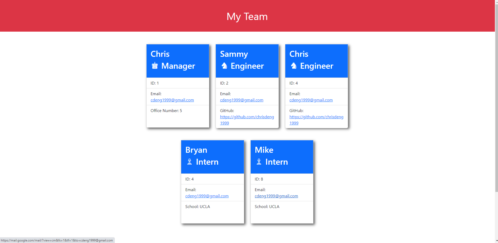
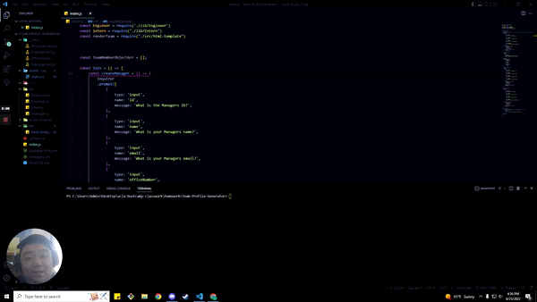

# **Team Profile Generator**

## **Table of Content**
- [Description](#description)
- [Installation](#installation)
- [Questions](#questions)

## **Description**
---

This is a Team Profile Generator that allows you to input your Manager, Engineer's, and Interns into display cards. This allows team managers to input all their team members and keep track of how many employees they currently have. 

Here is an example of what the website looks like once you have filled out your employee cards. Keep in mind you may input as many Engineers or Interns as you would like.
$~~~~~~~~~~~$

$~~~~~~~~~~~~~~~~~~~~~~~$

Here is a short clip of what the video will look like.

$~~~~~~~~~~~$

And here is the link to the full video demoing this project.

https://www.loom.com/share/20c294b5da9f435092b780a7080da247

$~~~~~~~~~~~$

## **Installation**
---

To install this project you must clone the repository. Once you have clones the repository you then type "node index.js" into the terminal and once you press enter you should then be prompted to fill out a Manager card. Once you have filled out that data you will move on into adding an Engineer or Intern. You may fill those out in any order because once you select the "I'm Done" option your team will be built in the order of Manager, Engineer. and Intern.

$~~~~~~~~~~~$

## **Questions**
---

- https://github.com/ChrisDeng1999
- <a href="https://mail.google.com/mail/?view=cm&fs=1&tf=1&to=cdeng1999@gmail.com" target= "_blank">cdeng1999@gmail.com</a>

#### Here is my Github page as well as my email address. If you have any questions, comments, or concerns please feel free to send me an email! Hope you enjoyed my project and have a wonderful day :D
$~~~~~~~~~~~$
